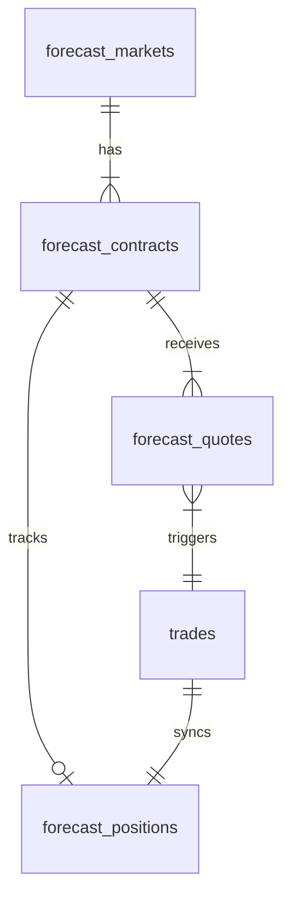

# Project Inventory & Technical Catalog

*   **Repository Root**: `/Users/joshmacbookair2020/Projects/algo_trading_final`
*   **Archiving Date**: 2026-07-07
*   **Operating Scope**: Kalshi Weather Predictions (Lane: `forecast`)

---

## Complete File Directory and Status Catalog

Below is a detailed inventory of the repository, categorizing each file by type, purpose, active status (Active, Legacy/Archived, Test, or Diagnostic), and inclusion in the research package.

### 1. Root Orchestration & Daemons

| File Path | Type | Apparent Purpose | Status | Data/Entities | Include? | Rationale |
| :--- | :--- | :--- | :--- | :--- | :--- | :--- |
| [`execution_daemon.py`](file:///Users/joshmacbookair2020/Projects/algo_trading_final/execution_daemon.py) | Python Script | Long-lived execution daemon loop; runs strategy cycle, storage maintenance, and embeds Telegram operator bot. | **ACTIVE** | Deploys execution loops, calls `run_execution_cycle()`. | Yes | Core runtime supervisor. |
| [`sniper_cron.py`](file:///Users/joshmacbookair2020/Projects/algo_trading_final/sniper_cron.py) | Python Script | Single-pass script to run a single execution pass (discovery, quotes, strategy, exits) and exits. | **ACTIVE** | Calls `run_execution_cycle()` once. | Yes | Alternate entry point for cron execution. |
| [`telegram_daemon.py`](file:///Users/joshmacbookair2020/Projects/algo_trading_final/telegram_daemon.py) | Python Script | Launches standalone Telegram bot loop for mobile control. | **ACTIVE** | Handles whitelisted chat commands. | Yes | UI and user notification boundary. |
| [`learning_loop.py`](file:///Users/joshmacbookair2020/Projects/algo_trading_final/learning_loop.py) | Python Script | Stale orchestrator designed to retrain ML features. | **LEGACY** | Refers to Spot/Crypto learning loops. | Yes | Documents legacy outer loop. |
| [`kill_switch.py`](file:///Users/joshmacbookair2020/Projects/algo_trading_final/kill_switch.py) | Python Script | Emergency manual switch to halt trading or force exit. | **ACTIVE** | Alters global runtime gate state in DB. | Yes | SRE risk control. |

### 2. Strategy and Forecast Core (in `/forecast/`)

| File Path | Type | Apparent Purpose | Status | Data/Entities | Include? | Rationale |
| :--- | :--- | :--- | :--- | :--- | :--- | :--- |
| [`forecast/runner.py`](file:///Users/joshmacbookair2020/Projects/algo_trading_final/forecast/runner.py) | Python Script | Orchestrates the discovery, quote refreshes, and strategy eval loops. Runs take-profit and toxic salvage exits. | **ACTIVE** | Connects broker to DB, executes trades. | Yes | Primary coordinate system of the forecast lane. |
| [`forecast/strategy_engine.py`](file:///Users/joshmacbookair2020/Projects/algo_trading_final/forecast/strategy_engine.py) | Python Script | Consumes deterministic-model weather probabilities, applies convergence and active market/risk gates, and calculates continuous sizing. | **ACTIVE** | Rejects retired commercial-ensemble payloads and enforces the canonical fee-aware decision path. | Yes | Strategy heart; contains SRE sizing checks. |
| [`forecast/db.py`](file:///Users/joshmacbookair2020/Projects/algo_trading_final/forecast/db.py) | Python Script | Forecast-specific SQL queries for active contracts, quotes, resolutions, and position caching. | **ACTIVE** | Caches tables in `logs/trades.db`. | Yes | SQL interface for forecast metadata. |
| [`forecast/weather_contracts.py`](file:///Users/joshmacbookair2020/Projects/algo_trading_final/forecast/weather_contracts.py) | Python Script | Parses Kalshi ticker series and contract names into weather metrics (Temp, Precip, Wind) and thresholds. | **ACTIVE** | Maps symbols to contract bounds (High/Low/Precip). | Yes | Contract semantics parser. |
| [`forecast/discovery.py`](file:///Users/joshmacbookair2020/Projects/algo_trading_final/forecast/discovery.py) | Python Script | Syncs active/tradable Kalshi weather markets and strikes into the database. | **ACTIVE** | Inserts into `forecast_markets` and `forecast_contracts`. | Yes | Market scanner interface. |
| [`forecast/quote_harvester.py`](file:///Users/joshmacbookair2020/Projects/algo_trading_final/forecast/quote_harvester.py) | Python Script | Pulls raw bid/ask order book data from Kalshi REST API. | **ACTIVE** | Writes snapshots to `forecast_quotes`. | Yes | Order book data pipeline. |
| [`forecast/market_snapshot.py`](file:///Users/joshmacbookair2020/Projects/algo_trading_final/forecast/market_snapshot.py) | Python Script | Groups quotes, historical bars, and weather forecasts into a structured snapshot. | **ACTIVE** | Formats GFS/ECMWF and spreads. | Yes | Strategy input model. |
| [`forecast/resolution_sync.py`](file:///Users/joshmacbookair2020/Projects/algo_trading_final/forecast/resolution_sync.py) | Python Script | Safe settlement checker that polls resolved contracts from Kalshi. | **ACTIVE** | Populates resolved outcomes. | Yes | Settlement tracking. |

### 3. Execution Layer (in `/execution/`)

| File Path | Type | Apparent Purpose | Status | Data/Entities | Include? | Rationale |
| :--- | :--- | :--- | :--- | :--- | :--- | :--- |
| [`execution/kalshi_broker.py`](file:///Users/joshmacbookair2020/Projects/algo_trading_final/execution/kalshi_broker.py) | Python Script | Handles cryptographic key signing, REST requests, order placing, portfolio positions, and balance inquiries. | **ACTIVE** | Communicates with Kalshi API v2. | Yes | Signed broker connection interface. |
| [`execution/kalshi_execution_controller.py`](file:///Users/joshmacbookair2020/Projects/algo_trading_final/execution/kalshi_execution_controller.py) | Python Script | Translates high-level trading decisions (TradeIntent) into taker-only IOC REST entries. | **ACTIVE** | Manages order parameters and sizing checks. | Yes | Order routing manager. |

### 4. Learning & Incubation (in `/learning/`)

| File Path | Type | Apparent Purpose | Status | Data/Entities | Include? | Rationale |
| :--- | :--- | :--- | :--- | :--- | :--- | :--- |
| [`learning/signal_performance.py`](file:///Users/joshmacbookair2020/Projects/algo_trading_final/learning/signal_performance.py) | Python Script | Evaluates historic GFS/ECMWF member accuracy. | **OBSERVATIONAL** | Not connected to active entry path. | Yes | Context on signal modeling. |

### 5. Notifications & Operator Bot (in `/notifications/`)

| File Path | Type | Apparent Purpose | Status | Data/Entities | Include? | Rationale |
| :--- | :--- | :--- | :--- | :--- | :--- | :--- |
| [`notifications/telegram_bot.py`](file:///Users/joshmacbookair2020/Projects/algo_trading_final/notifications/telegram_bot.py) | Python Script | Manages whitelist chat polling and replies to commands. | **ACTIVE** | Exposes `/status`, `/balance` commands. | Yes | Interactive HUD framework. |
| [`notifications/notification_engine.py`](file:///Users/joshmacbookair2020/Projects/algo_trading_final/notifications/notification_engine.py) | Python Script | Central hub for dispatching system messages to Telegram. | **ACTIVE** | Sends alert events to operator. | Yes | Notification engine. |
| [`notifications/sovereign_mobile_hud.py`](file:///Users/joshmacbookair2020/Projects/algo_trading_final/notifications/sovereign_mobile_hud.py) | Python Script | Renders performance statistics for Telegram. | **ACTIVE** | Computes current active metrics. | Yes | Operator HUD metrics. |
| [`notifications/reports.py`](file:///Users/joshmacbookair2020/Projects/algo_trading_final/notifications/reports.py) | Python Script | Creates daily and weekly trade reports. | **ACTIVE** | Aggregates DB statistics. | Yes | Telemetry reports. |
| [`notifications/ai_agent.py`](file:///Users/joshmacbookair2020/Projects/algo_trading_final/notifications/ai_agent.py) | Python Script | Agent core designed to answer operator questions. | **EXPERIMENTAL** | Exposes tools for database searches. | Yes | AI command controller. |

### 6. System Runtime, SRE, and Safety (in `/runtime/`)

| File Path | Type | Apparent Purpose | Status | Data/Entities | Include? | Rationale |
| :--- | :--- | :--- | :--- | :--- | :--- | :--- |
| [`runtime/economics.py`](file:///Users/joshmacbookair2020/Projects/algo_trading_final/runtime/economics.py) | Python Script | Holds threshold classes for economics checks. | **ACTIVE** | Standard boundaries. | Yes | Part of the gatekeeper logic. |
| [`runtime/runtime_state.py`](file:///Users/joshmacbookair2020/Projects/algo_trading_final/runtime/runtime_state.py) | Python Script | Stores system process heartbeat and active lane status in database. | **ACTIVE** | Tracks global state. | Yes | Daemon health records. |
| [`runtime/position_reconciler.py`](file:///Users/joshmacbookair2020/Projects/algo_trading_final/runtime/position_reconciler.py) | Python Script | Syncs active holdings from Kalshi into local database. | **ACTIVE** | Reconciles discrepancies. | Yes | Position synchronization. |
| [`runtime/operator_truth.py`](file:///Users/joshmacbookair2020/Projects/algo_trading_final/runtime/operator_truth.py) | Python Script | Implements promotion and release audit validation. | **ACTIVE** | Audits files, configs, tests. | Yes | Release gate integrity checks. |
| [`runtime/storage_guard.py`](file:///Users/joshmacbookair2020/Projects/algo_trading_final/runtime/storage_guard.py) | Python Script | Monitors free disk space and skips trade cycles if low. | **ACTIVE** | Safety threshold checks. | Yes | Storage guard safety loop. |
| [`runtime/storage_maintenance.py`](file:///Users/joshmacbookair2020/Projects/algo_trading_final/runtime/storage_maintenance.py) | Python Script | Cleans stale backtest files and truncates logs. | **ACTIVE** | Clean-up cron tasks. | Yes | Log maintenance routines. |

### 7. Databases & Caches (in `/logs/` and Root)

| File Path | Type | Apparent Purpose | Status | Data/Entities | Include? | Rationale |
| :--- | :--- | :--- | :--- | :--- | :--- | :--- |
| [`logs/trades.db`](file:///Users/joshmacbookair2020/Projects/algo_trading_final/logs/trades.db) | SQLite DB | The local repository database. It may be stale or partial; live broker and droplet database truth are authoritative for production audits. | **ACTIVE** | Runtime-managed SQLite. | Yes | Local development telemetry only. |
| [`logs/weather_snapshot.json`](file:///Users/joshmacbookair2020/Projects/algo_trading_final/logs/weather_snapshot.json) | JSON | Cached deterministic GFS/ECMWF/AIGFS forecasts, predictive sigma, and METAR/HRRR state for active cities. | **ACTIVE** | Runtime-generated; size and series count vary. | Yes | Raw weather inputs. |
| [`logs/weather_watermarks.json`](file:///Users/joshmacbookair2020/Projects/algo_trading_final/logs/weather_watermarks.json) | JSON | Intraday observed high/low temperatures. | **POLLUTED** | All values overwritten with `74.0` mock temp. | Yes | Highlights test isolation bug. |
| [`logs/csv/`](file:///Users/joshmacbookair2020/Projects/algo_trading_final/logs/csv) | Directory | Flat file duplicates of logged trades. | **ACTIVE** | Daily trade CSVs. | Yes | Redundant trade audit trail. |
| [`logs/backtest/`](file:///Users/joshmacbookair2020/Projects/algo_trading_final/logs/backtest) | Directory | Legacy symbols model fit files (e.g. BTC_30d). | **LEGACY** | Crypto/Spot backtest metadata. | No | Outside of Kalshi weather scope. |

### 8. Project Configurations & Rules

| File Path | Type | Apparent Purpose | Status | Data/Entities | Include? | Rationale |
| :--- | :--- | :--- | :--- | :--- | :--- | :--- |
| [`config.py`](file:///Users/joshmacbookair2020/Projects/algo_trading_final/config.py) | Python Script | Central configuration script parsing environment variables and defining fee math, limits, and settings. | **ACTIVE** | Loads `.env`; defines constants. | Yes | Core configuration parameters. |
| [`config/hub_params.json`](file:///Users/joshmacbookair2020/Projects/algo_trading_final/config/hub_params.json) | JSON | Overrides for regional hard conviction floor thresholds (SRE regional caps). | **ACTIVE** | Per-hub overrides (0.50 - 0.70). | Yes | Regional risk adjustments. |
| [`.env.example`](file:///Users/joshmacbookair2020/Projects/algo_trading_final/.env.example) | Env | Standard template for environment variables. | **ACTIVE** | Setup variables. | Yes | Project setup documentation. |
| [`AGENTS.md`](file:///Users/joshmacbookair2020/Projects/algo_trading_final/AGENTS.md) | Markdown | Operator command documentation and lane rules. | **ACTIVE** | File mappings, commands. | Yes | Operations manual. |
| [`GEMINI.md`](file:///Users/joshmacbookair2020/Projects/algo_trading_final/GEMINI.md) | Markdown | SRE Quantitative Checklist. | **ACTIVE** | 5 SRE Checks, execution commands. | Yes | Operational handbook. |
| [`CHANGELOG.md`](file:///Users/joshmacbookair2020/Projects/algo_trading_final/CHANGELOG.md) | Markdown | Log of release modifications. | **ACTIVE** | Version history details. | Yes | Version archaeology traces. |

---

## Confirmed Data Entities & Relationships

*   **CONFIRMED (Direct Database Evidence)**:
    *   `forecast_markets`: Holds metadata for the weather and economic underliers.
    *   `forecast_contracts`: Maps to individual strike contracts, resolution dates, and symbols.
    *   `forecast_quotes`: Stores bid/ask histories for active contracts.
    *   `trades`: Logs execution orders with actual fills, sizes, fees, and sides.
    *   `forecast_positions`: Caches active broker positions.
*   **INFERRED (System/Code Logic)**:
    *   `weather_watermarks.json` and `weather_snapshot.json` hold the raw observation and forecast states feeding into `forecast/strategy_engine.py`'s alpha engine.
*   **UNKNOWN**:
    *   The `forecast_resolutions` table and `weather_calibration` tables are completely empty, indicating that historical settlement sync was never completed or ran in the local active environment.
