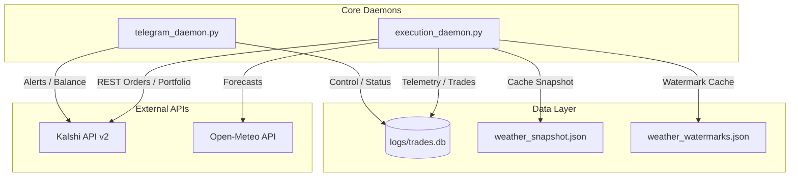

# System Architecture Summary

This document describes the high-level system components, execution daemons, automation loops, external dependencies, and structural data flows of the Kalshi weather trading bot.

---

## 1. System Overview

The system operates as a **lean dual-process live execution bot** designed exclusively for Kalshi Climate and Weather prediction markets. The active architecture consists of two long-running daemons: the core execution loop and the Telegram operator bot.

---

## 2. Core Components

### 2.1 Orchestration & Scheduling
*   **`execution_daemon.py` (Active)**: A long-running loop that runs the trading cycle every 5 minutes (default `SNIPER_SLEEP_SECONDS=300`). It manages disk maintenance, handles startup reconciliation, and runs the embedded Telegram bot thread.
*   **`sniper_cron.py` (Active)**: A single-pass CLI command that runs the exact same execution sequence once and exits.
*   **`telegram_daemon.py` (Active)**: An independent process providing the Telegram Operator interface.

### 2.2 Strategy & Alpha Processing
*   **`forecast/runner.py` (Active)**: Coordinates the sequential execution steps in each 5-minute cycle:
    1.  *Discovery*: Syncs the active contract list from Kalshi.
    2.  *Cleanup*: Deactivates expired contracts.
    3.  *Weather Hydration*: Pulls fresh GFS/ECMWF forecasts if stale.
    4.  *Quote Harvest*: Collects L2 book spreads.
    5.  *Strategy Cycle*: Evaluates the strategy, applies gates, sizes, and submits trades.
    6.  *Position Monitor*: Executes exit policies (Salvage/TP/Bracket busts).
    7.  *Resolution Sync*: Downloads settlement records.
*   **`forecast/strategy_engine.py` (Active)**: Loads cached weather parameters, blends GFS and ECMWF models, runs multi-factor SRE gates, and calculates position sizing.

### 2.3 Broker & Order Management
*   **`execution/kalshi_broker.py` (Active)**: Handles REST communication with Kalshi's API using RSA private key signing. Fetches positions, balances, and submits REST calls.
*   **`execution/kalshi_execution_controller.py` (Active)**: Houses the order execution strategy (Limit IOC or Resting orders) and manages order execution bounds.

---

## 3. Core Data & Execution Flows

### 3.1 Weather Data Flow
1.  **Ensemble Forecast Retrieval**: GFS (Global Forecast System) and ECMWF (European Centre for Medium-Range Weather Forecasts) model data are fetched from **Open-Meteo API** (via `data/kalshi_weather_monitor.py`).
2.  **JSON Caching**: Raw forecast member arrays are written to `logs/weather_snapshot.json`.
3.  **Real-Time METAR Observations**: Intraday station observations are scraped from NOAA/AviationWeather METAR reports and cached to `logs/weather_watermarks.json` to keep track of temperature high/low boundaries.
    *   > [!WARNING]
        > **CONFIRMED ARCHITECTURAL BUG**: Unit tests (`tests/proof/test_weather_intraday_watermarks.py`) lack filesystem isolation. When executed, they overwrite the production `logs/weather_watermarks.json` with a mock temperature of `74.0` across multiple dates, corrupting live exit evaluations.

### 3.2 Strategy & Sizing Flow
1.  **Paired Quotes**: Quote harvester fetches bid/ask prices and sizes for YES and NO sides.
2.  **Probability Blending**: GFS and ECMWF probabilities are blended using static weights (60% GFS, 40% ECMWF).
3.  **Uncertainty Adjustment**: AI/GraphCast deterministic predictions are evaluated. If the AI deviates from the ensemble mean, volatility ($\sigma$) is scaled upwards, reducing position size.
4.  **Continuous Kelly Sizing**: Sizing is determined via fractional Kelly, capped at 10% bankroll (`KALSHI_KELLY_CAP = 0.10`).

### 3.3 Thermodynamic Netting Flow (SRE Compliance)
*   **CONFIRMED (Strict Mathematical Netting)**:
    *   To prevent over-exposure to highly correlated weather outcomes in the same geographic region, the bot sums regional exposures using signed thermodynamics *before* performing absolute limit checks.
    *   *Signed Outcome Map*:
        *   Cool/Wet Outcomes (`KXLOW`, `RAIN`, `KXRAIN`, `KXSNOW`, `KXWIND`) YES = `-1.0` (NO = `+1.0`).
        *   Warm/Dry Outcomes (`KXHIGH`, `KXTEMP`) YES = `+1.0` (NO = `-1.0`).
    *   *Formula*: Regional Net Exposure = `abs(sum(exposure * sign))`.
    *   This is checked against the Regional Hub Cap calculated dynamically based on account size.

### 3.4 Trade Execution Flow
1.  **Limit Order Submission**: Orders are submitted to Kalshi.
2.  **SQL Database Logging**: Executions are logged to the `trades` table in `logs/trades.db`.
3.  **Flat-File Backup Logging**: Simultaneously appended to daily CSV backups: `logs/csv/trades_YYYY-MM-DD.csv`.
4.  **Discrepancy (Timing Race)**: Position reconciler syncs active positions immediately after trade submissions. If a position syncs before the trade is committed or if DB locks occur, the reconciler falls back to order book mid-prices ($0.35), which explains the price mismatch between `trades` and `forecast_positions`.

---

## 4. Known Dependencies & Infrastructure

### 4.1 External APIs & Services
*   **Kalshi API v2**: Exchange REST endpoint for execution, order book quotes, and account status.
*   **Open-Meteo API**: Meteorological data feed for GFS/ECMWF model runs.
*   **AviationWeather (METAR)**: Scraped NOAA METAR text reports for real-time station temp observations.
*   **Telegram Bot API**: Used by the notification engine and operator bot.
*   **Grafana / Prometheus (Optional)**: If enabled, exports SRE metrics (volatility, balance, Brier scores).

### 4.2 Key Environment Variables
*   `ALGO_RUNTIME_DIR`: Directory for database and cache outputs (defaults to `./logs/`).
*   `FORECAST_LANE_ACTIVE`: Toggles weather predictions lane (`true`).
*   `FORECAST_AUTONOMOUS_ENABLED`: Allows the bot to place orders without manual checks (`false` by default, manual entries `true`).
*   `KALSHI_API_KEY_ID` & `KALSHI_PRIVATE_KEY_PATH`: API credentials.
*   `MIN_FREE_DISK_MB`: SRE disk guard threshold (`2048` MB).

---

## 5. Architectural Unclear Areas

*   **INFERRED**: The Streamlit cockpit dashboard (`dashboard/streamlit_app.py`) appears to be legacy or used only for local developer audits, as it is not active in production Docker configurations.
*   **UNKNOWN**: Postgres DB support (`DB_USE_POSTGRES=true`) exists in `config.py` and `db.py` but is completely untested in the active lane rules, which dictate SQLite-only WAL mode.
